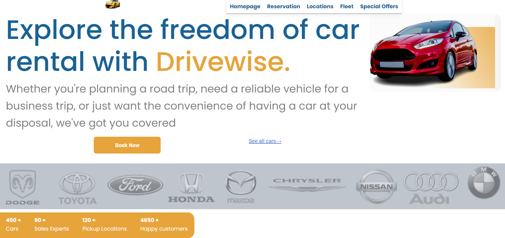

## Drivewise Car Hire Frontend Project

## Technologies Used

- React: A JavaScript library for building user interfaces.
- [MdB REACT (Material Design for bootstrap 5 & React 18) ](https://mdbootstrap.com/docs/react/)
- [Vite (Next Generation Frontend Tooling)](https://vitejs.dev/)

## Getting Started

Follow these steps to get the Car Hire frontend project up and running on your local machine:

1. Clone the repository: `git clone <repository_url>`
2. Navigate to the project directory: `cd Drivewise-car-hire-react`
3. Install the dependencies: `npm install`
4. Start the development server: `npm run dev`
5. Open your browser and visit: `http://localhost:5173`

## Contributing

Contributions are welcome! If you find any issues or have suggestions for improvements, please feel free to open an issue or submit a pull request.

## License

This project is licensed under the [MIT License](LICENSE).
